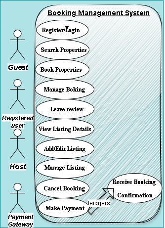

# Requirement Analysis in Software Development

## Introduction
Requirement Analysis is a fundamental stage in the **Software Development Life Cycle (SDLC)**.  
It focuses on identifying, documenting, and validating the needs and expectations of stakeholders to ensure that the final software product aligns with business goals and user demands.  

This repository uses a **Booking Management System** case study to demonstrate:  
- The role and importance of requirement analysis  
- Core activities involved  
- Differences between functional and non-functional requirements  
- The use of diagrams to visualize system interactions  
- How acceptance criteria ensure clarity and project success  

---

## What is Requirement Analysis?
Requirement Analysis is the process of studying project needs, clarifying objectives, and translating them into detailed requirements.  
It serves as the **blueprint for development** by bridging the gap between stakeholders and developers.  

Key purposes include:  
- Avoiding ambiguity in communication  
- Building a shared understanding of the system  
- Reducing costly changes later in the project  

---

## Why is Requirement Analysis Important?
Requirement Analysis plays a crucial role in ensuring project success. Its importance can be seen in how it:  

1. **Prevents Misunderstandings**  
   Clearly defines what is expected, reducing confusion between stakeholders and developers.  

2. **Improves Planning and Timelines**  
   Establishes priorities and helps teams focus on what truly matters.  

3. **Aligns Goals**  
   Connects business objectives with end-user needs, resulting in better usability and overall satisfaction.  

---

## Key Activities in Requirement Analysis
The process typically involves several structured activities:  

- **Requirement Gathering** → Collecting information from stakeholders, users, and documents.  
- **Requirement Elicitation** → Digging deeper to uncover hidden needs and constraints.  
- **Requirement Documentation** → Writing down requirements in clear, structured formats.  
- **Requirement Analysis and Modeling** → Studying requirements for consistency and representing them using models/diagrams.  
- **Requirement Validation** → Confirming that requirements match user needs and business goals.  

---

## Types of Requirements

### Functional Requirements
These describe what the system must do (features and behaviors).  
Examples for the Booking System:  
- Users must be able to **search for available tickets**.  
- The system must allow users to **book tickets and cancel bookings**.  
- The system must send an **email confirmation after a successful booking**.  

### Non-functional Requirements
These describe the quality, constraints, or conditions under which the system operates.  
Examples for the Booking System:  
- The system must support **at least 100 concurrent users without performance issues**.  
- Response time for any user action must be **under 2 seconds**.  
- The system must be **available 99.9% of the time** (high availability).  

---

## Use Case Diagrams
A **Use Case Diagram** illustrates the interactions between actors (users or external systems) and the system.  
They are useful for clarifying system boundaries and expected functionalities.  

Below is the use case diagram for the booking management system:  

  

---

## Acceptance Criteria
Acceptance Criteria define the conditions that must be met for a feature to be considered successfully implemented.  

**Why it matters:**  
- Provides clarity to both developers and testers.  
- Ensures that deliverables align with expectations.  
- Acts as a checklist for project completion.  

**Example – Checkout Feature**  
For the booking system, the checkout process is considered complete if:  
1. The user can add tickets to a cart.  
2. The user can proceed to checkout and confirm their booking.  
3. The system processes the payment and updates booking status.  
4. An email confirmation is sent to the user after successful payment.  

---

## Conclusion
Requirement Analysis lays the groundwork for building reliable and user-centered systems.  
By carefully gathering, documenting, and validating requirements, teams can minimize risks, avoid costly errors, and deliver software that truly meets its purpose.
